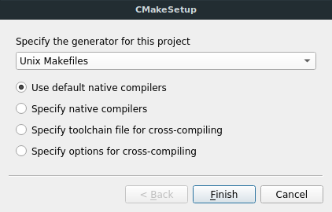
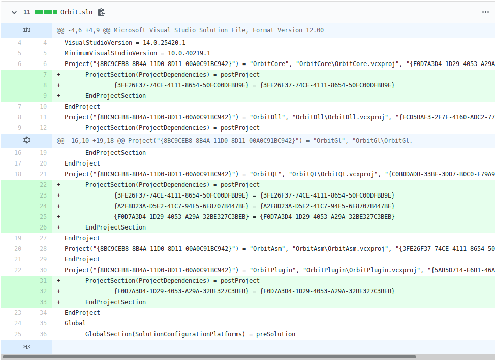
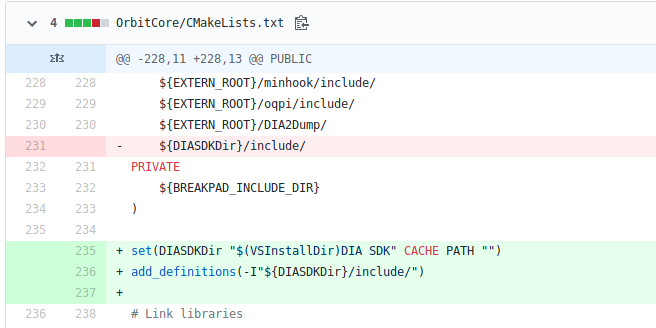
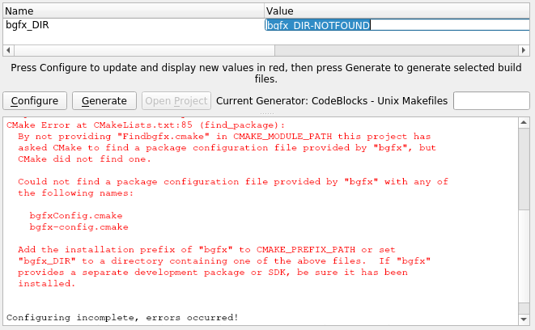

# CMake 

Sandy Carter - October 2019 - Guest Lecture

Note:

SELF: Use layout default with big current slide on left.

Introduce self and experience with CMake.

About 10 years experience with open source and professional experience.

Ask about cmake experience.

Truth of the matter is most people and project do not use CMake well and while
some projects can work very well, some platforms suffer. Mainly Windows.
I will focus on windows experience due to CMake usually working out of the box
on linux.

Please interrupt me if you have a question. I will be happy to answer.

Slides will be available in the chat.

---

## History

* Development began in 1999
* Inspired by `pcmaker` by Ken Martin
* Initial release: 2000
* Old CMake (Version 2.*): April 2005
    * `UPPER_CASE_COMMANDS()`
* Modern CMake (Version 3.*): June 2014
    * `lower_case_commands()`
    * `target_*` commands
    * You should be using Modern CMake principles  <!-- .element: class="fragment" -->

Note:
* Funded by the US national Library of Medicine
* Goal: Cross-platform build environment for the Insight Segementation and Registration Toolkit (ITK) mimicking Unix configure scripts.
* This talk will be about modern CMake, which is version 3 and later
* Be sure to use modern cmake
* Easy to spot old style:
    * `UPPER_CASE_COMMANDS`
    * Does not use `target_*` commands
    * Minimul required version is less than 3
* You should be using Modern CMake!
* Modern CMake (Version 3.0): June 2014
    * Introduction of target-specific commands and properties to replace CMake 2 commands.

---

## Why use CMake?

----

### Open Source
License BSD 3-clause

Note:

A growing number of C and C++ projects either support CMake or rely entirely on CMake for building.

----

### Cross-platform
* Windows 32-bit and 64-bit
* MinGW/MSYS2 + Cygwin
* Mac OSX 10.7 or later
* Linux (Virtually all distros and architectures)
* FreeBSD and more!

Note:
CMake.org offers binaries for Windows, Mac and Linux.
Other platforms and distributions distribute their own binaries.
Most exotic platforms can use cmake by compiling it from source.

----

### Multiple Generators
> No need to retarget Windows SDK

```bash
$ cmake -G "Name of generator" ...
```


Note:
CMake automatically selects the correct compiler and sdk on windows so you can
share a project without having the same windows SDK or even the same version of
visual studio.

----

### Multiple Generators

* Makefiles (Borland, MSYS/MinGW, NMake, Unix, Watcom)
* Visual Studio .sln (6, 7, 2005, 2010, 2012, 2013, 2015, 2017, 2019)
* Ninja
* Clion (Native)
* CodeBlocks
* Code Lite, Eclipse, Kate, Sublime Text, etc.


Note:
If you don't want to use visual studio, you have many choices of different
generators.

If you're on different platforms or using different IDEs, many of them support
CMake or CMake supports generating projects for them.

VS2017 and VS2019 have CMake support as well as generators.
Generators create the sln and vcproj while native support reads the CMakeLists directly.

----

### Cross Compile with toolsets

* MinGW-64
* Arduino
* Docker
* IOS
* Android
* WebAssembly
* AVR, ARM, PPC, etc

Note:
You can compile from one platform to another with toolsets.
Toolsets are cmake scripts for finding cross-compilers and related libraries.

----

### Project Configuration as Code



Note:
If you've ever worked on a project using git and visual studio solutions, the
changes to a project such as dependencies, added projects or modified compiler
options are very hard to follow.
This is partly because solution files are not really meant to be human-readable
and are stored in an xml file.
Reading this is like reading changes to a word document with notepad.

Commit message
* Fixed project build dependencies.
https://github.com/pierricgimmig/orbitprofiler/commit/4a58983c28dad55177dca8f30a2aa33027a4346b#diff-319ff2ff7803e594157e0b401c1ae7c2

----

<!-- .slide: data-background="./sln-commit.png" -->


Note:
Can you tell what's happening here?

Commit message
* Fixed project build dependencies.
https://github.com/pierricgimmig/orbitprofiler/commit/4a58983c28dad55177dca8f30a2aa33027a4346b#diff-319ff2ff7803e594157e0b401c1ae7c2

----

### Project Configuration as Code



<small>https://github.com/pierricgimmig/orbitprofiler</small>

Note:

This is the same project but later when using CMake.

CMake configuration files are writen with their own scripting language.
This means that changes are:

* Readable
* Mergeable
* Debuggable
* Revertable

Commit message:
* Fixed DIA SDK directory.
* Note that `add_definitions` should be `target_add_definitions` per modern cmake
* https://github.com/pierricgimmig/orbitprofiler/commit/b259935e5478f7beab7ddd6efba061f1fabf0f07#diff-9351342761fceaf9046e4bb8314f3693

---

## Using CMake

Note:
Moving on to how cmake works.

----

### Stages

1. Configure
    * Multi-platform select, options, packages
    * `CMakeCache.txt`
2. Generate
3. Build
4. Install
5. Test, Package, etc

Notes:

I'm going to do a brief overview of the stages of using cmake.

1. Configure
    1. Select compiler, linker, toolset, generator
    2. Options
    3. `find_package`
    4. Create `CMakeCache.txt`
    5. Generated source files and other custom commands
2. Generate
    1. Creates sln/makefile/xcode, etc
3. Build
    1. Pre-build commands
    2. Object code
    3. Post-build commands
    4. Linking
    5. Post-linking commands

Developer should not edit generated files (sln, Makefiles) not should she include them in VCS (use you .gitignore)
In visual studio, Configure and Generate are run in `ZERO_CHECK` when a cmake configuration file is edited.

https://github.com/TheErk/CMake-tutorial/blob/master/precompiled-PDFs/2012-02-08-CMake-tutorial-Toulibre.pdf

----

### Build Types

1. Debug
2. Release
3. RelWithDebInfo
4. MinSizeRel
5. Add your own!

Notes:

By Default, CMake can generate 4 Build types (Configurations in visual studio).

Most are familiar with Debug and Release.

* RelWithDebInfo is Release but with debug symbols attached
* MinSizeRel is release but with optimization on the size of the executable
  instead of runtime as with Release. Useful for embedded devices or optimizing
  for instruction cache.
* Build Types can be added in the CMake Configuration so don't be afraid to
  roll out your own such as a RelWithProfiler or DebugWithoutStd

----

### Creating a CMake project

```cmake
# CMakeLists.txt

# Set the minimum required version of CMake for this project.
# Error will be raised if version is too low.
cmake_minimum_required(VERSION 3.10 FATAL_ERROR)

# Give the project a name.
# This is analogous to a solution name in VS
project(hello_cmake)
```

Note:
The configuration is done in a file called `CMakeLists.txt` at the root of the
project. This file and all cmake files it includes or adds are the files which
need to be included in git.

It is important to set a minimum required version of CMake.

The version needs to be a the version of the newest feature of CMake used or
that you plan to use.

I recommend also adding `FATAL_ERROR` to prevent older versions of CMake from
attempting to configure a project.

Setting a newer version of CMake as the minimum required helps future proof a
project by limiting how far back you're willing to support CMake. It's easier
to do earlier in a project than later when the project is larger.

We will touch on CMake versions later.

The project Name is a high level name for the project. It does not need to be
the name of the executable. This is analogous to a solution in CMake.

For example, you can have a project with a lot of little libraries all with
different names but they all belong to a project with a single name.

e.g. boost, opencv, GNU toolkit

----

### Basic Configuration (Exe)

```cmake
cmake_minimum_required(VERSION 3.10 FATAL_ERROR)

project(hello_cmake)

# Define an executable
add_executable(
  # Executable name
  hello_cmake
  # Files required to compile
  main.cpp other.cpp
)
```

Note:

This is an example of a simple CMakeLists.txt we create a executable called
`hello_cmake` made with two source files relative to the `CMakeLists.txt`
directory:
* `main.cpp`
* `other.cpp`

The name here is the same as the project but it doesn't have to.

It's a very simple example and we will add library dependencies to it later.

----

### Basic Configuration (Lib)

```cmake
cmake_minimum_required(VERSION 3.10 FATAL_ERROR)

project(hello_cmake)

# Define a library
add_library(
  # Library name
  hello_cmake_library
  # Can be SHARED (.dll/.so) or STATIC (.lib/.a)
  SHARED               
  # Files required to compile
  hello_cmake_lib.cpp other.cpp
)
```

Note:

This is a simple example of a library.

Just like adding an executable, this adds a library (code without a main
execution funtion).

As with the executable, it is defined with a name and the source files, in this case:
* `hello_cmake_lib.cpp`
* `other.cpp`

There is a new qualifier, however:
* `SHARED`: dynamic library, this can changed after compiling. It is loaded
            when the executable is starts, not part of the excutable.
* `STATIC`: static library, this is an object file that hasn't linked. It is
            linked with the executable when the executable compiles and is part
            of the executable. Typically this results in a larger executable.

----

### Variables

```cmake
cmake_minimum_required(VERSION 3.10 FATAL_ERROR)
project(hello_cmake)

file(
  # GLOB to match a regular expression
  GLOB
  # Name of output variable
  LIBRARY_SOURCE_FILES
  # Regular expression pattern
  lib/*.cpp
)

# Variables values are accessed by putting their names in ${}
add_library(hello_cmake_library SHARED ${LIBRARY_SOURCE_FILES})
```

Notes:
Here is an example use of a variable: `LIBRARY_SOURCE_FILES`

We are defining a new variable using the function `file` with the option `GLOB`.

What this does is scan the file system at configuration time. It will look at
the regular expression `lib/*.cpp` and add all files matching to a variable with
the name supplied.

Since CMake is a scripting language, there isn't any declaring of variables,
just defining.

Getting the value out of a variable is done using a dollar sign + brace combination.
Dereferring a variable which was not defined will result in an empty value.

* .h files are not needed to compile a c++ project, but it is nice to include
  them as they are will be included in a visual studio solution but this serves
  no practical purpose to cmake

----

## Using CMake

### Linking

```cmake
file(GLOB LIBRARY_SOURCE_FILES lib/*.cpp)
add_library(hello_cmake_library SHARED ${LIBRARY_SOURCE_FILES})

file(GLOB APP_SOURCE_FILES app/*.cpp)
add_executable(hello_cmake ${APP_SOURCE_FILES})

# Declare hello_cmake_library as a dependency and link with it
target_link_libraries(
  # Target in question: the executable
  hello_cmake
  # Inheritance (PRIVATE, PUBLIC or INTERFACE)
  PRIVATE  # targets depending on this will not inherit
    hello_cmake_library
)
```

Notes:

Linking is the main way to create dependencies between libraries and other
libraries and executables.

Note that we're using `target_link_libraries` which is the modern version of
`link_libraries`. `link_libraries` would apply to all libraries and exectuables
in a given scope (so all the targets declared in this `CMakeLists.txt` file).

The `target_` functions take the target as the first parameter, an inheritance
qualifier second, followed by the operations parameters next.

We will explore the different types inheritance in the next slide.

----

### Inheritance
```cmake
add_library(hello_cmake_library SHARED ${LIBRARY_SOURCE_FILES})
# Set different include directories for library and clients
target_include_directories(hello_cmake_library
  PRIVATE  # Applies to this target only
    lib/include/hello_cmake_library
  INTERFACE  # Applies to clients but not target
    lib/include # clients forced to #include <hello_cmake_library>
  PUBLIC  # Applies to both target and clients
    ${OTHER_LIB_INCLUDE_DIRECTORIES}
)

add_executable(hello_cmake ${APP_SOURCE_FILES})
# Linking with library inherits include directories
target_link_libraries(hello_cmake PRIVATE hello_cmake_library)
```

Notes:
This example is of a project which consists of an executable and a library.
The library is in the `lib/` folder. Its headers are meant to be distributed
with the `.dll`. We would like users of the library to include headers using
the name of the library so the headers are in `lib/include/hello_cmake_library`
but in the library, we would like not to have to include the library name and
just include directly. 

This is done very often with C++ libraries. Including the library name as a
folder prevents naming conflicts (e.g. both the exe and the lib have a math.h)
header file.

CMake allows us to do this very easily by adding a include directory as
`PRIVATE`. Private declarations are applied to the target but are not inherited
by any dependent project. `INTERFACE` parameters are inversely applied to the
dependent projects but not to the target. Finally, `PUBLIC` parameters are
applied to both.

Be careful with this and always default to `PRIVATE`. Large project with deep
dependencies can greatly suffer by having things declared `PUBLIC` as they
bring all the declarations of their dependencies recursively.

I've worked at a company with 50+ active developers and 120 libraries in a
solution where include directories were all set to public. This was the
principle contributor of compile time due to CMake rescanning changes and
regenerating unrealted projects in the solution. It also broke encapsulation
and people were adding unrelated headers to executables. There were circular
dependencies. It was crazy, sometimes 1h after a git pull to reload a solution.
Moving to `PRIVATE` by default helped clean up useless dependencies and
improved compile time.

Another reason to use `PUBLIC` is with compiler warning levels
e.g. `-Wall -Werror` on linux is nice to have for a library but if it is public
this means forcing this on another target which might not have such rigourous check.
It's not up to the dependency to dictate this and should limit itself to
providing the bare essentials.

Rule of thumb, if your library works without a certain definition, set it to 
`PRIVATE`.

In summary:
* Including a libary or exectuable will bring in their public and interface link targets, include paths,
* options and defines. Anything marked private will not be inherited.
* INTERFACE is like PUBLIC but doesn't apply to the current target. See next slide.

----

### External packages

```cmake
cmake_minimum_required(VERSION 3.10 FATAL_ERROR)
project(hello_cmake)

# Find OpenGL package installed on the system
# These are imported target aliases which means cmake won't try to
# compile them.
# Looks for cmake/Modules/FindOpenGL.cmake, this file defines how
# to find the lib and include directories and creates the aliases
find_package(OpenGL REQUIRED COMPONENTS GL GLU)

add_executable(hello_cmake main.cpp other.cpp)
# Link with both components from the OpenGL namespace
target_link_libraries(hello_cmake PRIVATE OpenGL::GL OpenGL::GLU)
```

Notes:
This is where most newcomers to CMake get stuck.

CMake works great with 3rd party external libraries and you should not have to include them in your project!
Unixes, MinGW/MSYS and even homebrew on mac do this very well, windows struggles a bit. This is because unlike the other
systems, windows lacks a package manager like apt, pacman or homebrew.

Typically on a dev's machine you have executables (in /usr/bin for unixes), or Program Files on Windows.

Libraries are located in their own place too (/usr/lib for linux), this is nebulous for Windows.

Maintainers of libraries also tend to not include cmake files with their libraries on Windows.

On top of that, CMake generates helper scripts to help find any CMake friendly libraries (in /usr/lib/cmake or /usr/share/cmake/Modules)

----

## Using CMake

### Package not found



Notes:
In this example `find_package` couldn't find a `Findbgfx.cmake` file in the `CMAKE_MODULE_PATH` and it couldn't find a `bgfxConfig.cmake` in `CMAKE_PREFIX_PATH`

The command has two modes by which it searches for packages: “Module” mode and “Config” mode. The above signature selects Module mode. If no module is found the command falls back to Config mode, described below. This fall back is disabled if the MODULE option is given.

If the MODULE option is not specfied in the above signature, CMake first searches for the package using Module mode. Then, if the package is not found, it searches again using Config mode.

A user may set the variable `CMAKE_FIND_PACKAGE_PREFER_CONFIG` to `TRUE` to direct CMake first search using Config mode before falling back to Module mode.

----

### Find Package Search Procedure

Windows
```
C:/Program Files/
C:/Program Files/(cmake|CMake)/
C:/Program Files/<name>*/
C:/Program Files/<name>*/(cmake|CMake)/
```
Unix
```
/usr/(lib/<arch>|lib*|share)/cmake/<name>*/
/usr/(lib/<arch>|lib*|share)/<name>*/
/usr/(lib/<arch>|lib*|share)/<name>*/(cmake|CMake)/
```

Note:
CMake will look in specific places.
These places are likely to contain the correct target if it is installed properly.
On linux and osx the package manager takes care of this.
On windows, sometimes (but rarely, an installer will put the Find/Config files in the right place),
often times you have to download the library yourself, run it through cmake, config, generate, compile and most importantly, INSTALL in C:/Program Files
Skipping this step means you have to deal with package not found errors and you may have to set the directory yourself, or specify a `CMAKE_PREFIX_PATH` of your own.

Package maintainers providing CMake package configuration files are encouraged to name and install them such that the Search Procedure outlined below will find them without requiring use of additional options.

----

### Other Useful Commands

```cmake
# Add precompiler definitions
target_compile_definitions(<target> <INTERFACE|PUBLIC|PRIVATE> [items1...])

# Add compiler-specific options (e.g. -Wall)
target_compile_options(<target> [BEFORE] <INTERFACE|PUBLIC|PRIVATE> [items1...])

# Add cross-compiler features (e.g. cxx_constexpr)
target_compile_features(<target> <PRIVATE|PUBLIC|INTERFACE> <feature> [...])

# Find an executable on the system
find_program (<VAR> name1 [path1 path2 ...])

# Generate a target using unusual commands (e.g. compiling shaders)
add_custom_target(Name [ALL] [command1 [args1...]] ...)
```

----

### Using a package manager

* `FetchContent` (CMake >= 3.11): https://cmake.org/cmake/help/latest/module/FetchContent.html
* Vcpkg: https://github.com/Microsoft/vcpkg
* Hunter: https://github.com/cpp-pm/hunter

Note:

There is movement towards making packaging in CMake easier for platforms
where package managers don't provide enough CMake libraries.

Since CMake 3.11, there is a configure time command `FetchContent` which can
clone or download a dependency and compile it if it contains a `CMakeLists.txt`
file at its root. The downside is that this can cause very long configure times
because you are essentially compiling your dependencies at first configuration.
It also requires an internet connection while configuring.

Microsoft has released a package manager for C and C++ called Vcpkg which
supplies a toolchain file for CMake. The dependencies are not compiled at
configuration time and they are installed on the system to be available for
other projects.

There is also Hunter which is another package manager for CMake which supports
pre-compiled packages. Like `FetchContent` it fetches at configure time. They
maintain forks of libraries so you have to check if they're maintained. Adding
a script is a little complex but open to anyone.

----

### Different versions of CMake

| Platform | Version |
|----------|---------------|
| Latest Release | 3.15.4  |
| Arch Linux  (rolling) | 3.15.4 |
| OSX (Homebrew) | 3.15.4 |
| Visual Studio 2019 | 3.14.1  |
| Ubuntu disco  (19.04) | 3.13.4 |
| Visual Studio 2017 | 3.12.1  |
| Ubuntu bionic  (18.04 LTS) | <span style="color:red">3.10.2</span> |


Notes:

Be careful, when using a minimum version if you want support multiple platforms.
Different OSs and even different IDEs support different versions of CMake
Be aware that the Long-term support version of Ubuntu which is also the default
distro of many continuous integration platforms is held back at 3.10 until the next
LTS in 2020. Updating on Ubuntu is non-trivial.

`FetchContent` is not availble for Ubuntu LTS.

---

## Resources

### Official resources

* Website: https://cmake.org
* Source: https://gitlab.kitware.com/cmake
* Documentation: https://cmake.org/cmake/help
* Wiki: https://gitlab.kitware.com/cmake/community/wikis
* Mailing list: https://cmake.org/mailing-lists

Note:
This is my talk, if need more information. Check the official channels.
I would advise against the official tutorial page. It is a decade out of date.

Next slide has good tutorials and resources for MODERN CMAKE

----

## Resources

### Guides

* Modern CMake: https://cliutils.gitlab.io/modern-cmake
* Effective Modern CMake: https://gist.github.com/mbinna/c61dbb39bca0e4fb7d1f73b0d66a4fd1
* CMake Anti-Antipatterns: https://blog.kevinwmatthews.com/cmake-anti-antipatterns
* Awesome CMake https://github.com/onqtam/awesome-cmake

Note:

That's my talk...
Questions?

---
# Questions?
